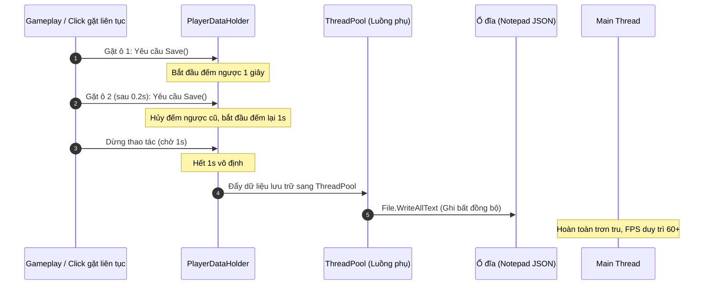

# Tài liệu Kỹ thuật Hệ thống Farm & Storage (Nông trại & Kho chứa)

Tài liệu này mô tả chi tiết kiến trúc kỹ thuật, mô hình dữ liệu, Máy trạng thái (FSM), vòng đời tính toán qua xung nhịp (Clock Tick), xử lý biên dịch assembly, tối ưu lưu trữ bất đồng bộ và cơ chế chống gian lận (Anti-Cheat) được xây dựng cho **Farm System** (Cây trồng & Vật nuôi) và **Storage System** (Kho chứa/Tiền tệ) trong dự án **Ptiter_FarmGame**.

---

## 1. Tổng quan Kiến trúc & Khử phụ thuộc vòng (DIP)

Để tránh lỗi **phụ thuộc vòng (Circular Dependency)** giữa module nông trại (`Farm`) và dữ liệu người chơi chính (`MyOwn`), hệ thống tách rời riêng hợp đồng kho chứa sang module **`Storage`** độc lập (leaf module):

```mermaid
graph TD
    subgraph MyOwn [Assembly chính: MyOwn]
        PlayerDataHolder[PlayerDataHolder]
        PlayerData[PlayerData]
    end

    subgraph Farm [Assembly độc lập: Farm]
        FarmService[FarmService]
        FarmSlotSaveData[FarmSlotSaveData]
    end

    subgraph Storage [Assembly độc lập: Storage]
        IStorageService[IStorageService]
        InventoryChangedPayload[InventoryChangedPayload]
    end

    PlayerDataHolder -.--> |Thực thi interface| IStorageService
    PlayerData --> |Chứa danh sách| FarmSlotSaveData
    FarmService --> |Inject thông qua| IStorageService
    PlayerDataHolder --> |Khởi tạo| FarmService
    FarmService -.--> |Tham chiếu đến| IStorageService
    PlayerDataHolder -.--> |Phát ra qua MessagePipe| InventoryChangedPayload
```

Bằng cách đưa giao diện `IStorageService` và sự kiện `InventoryChangedPayload` vào một assembly `Storage` nằm riêng biệt:
1. Module **`Farm`** chỉ cần tham chiếu tới **`Storage`** để mua hạt giống, trừ tiền xu, tiêu hao thức ăn, gieo trồng và nhập nông sản thu hoạch vào kho.
2. Module **`Cooking`** (Nấu ăn) tương lai cũng chỉ cần tham chiếu tới **`Storage`** để tiêu thụ nguyên liệu nấu nướng mà hoàn toàn không cần biết tới module `Farm`.
3. Assembly chính **`MyOwn`** đóng vai trò là nơi thực thi (Implement) và lắp ghép VContainer DI.

---

## 2. Xử lý Giới hạn Biên dịch Assembly (Assembly Boundary Workarounds)

Hệ thống UI của dự án sử dụng thư viện **Bruno Mikoski's UI Manager** và các file mã nguồn giao diện đặt trong thư mục `UI System` không có tệp `.asmdef`, dẫn đến việc chúng mặc định được biên dịch vào **`Assembly-CSharp`** (biên dịch sau cùng).

* **Thử thách**: Assembly `MyOwn` (chứa DI scope chính `GameLifetimeScope`) được biên dịch trước nên **không thể** import các lớp UI (như `FarmSeedSelectorUI`) để đăng ký trực tiếp vào VContainer.
* **Giải pháp**: 
  1. Tận dụng thuộc tính **`autoInjectGameObjects`** của `LifetimeScope` trên Scene để VContainer quét và tự động tiêm các dependencies vào UI.
  2. Khi UIManager sinh động (Instantiate) prefab UI lên, lớp cầu nối **`FarmUIBridge`** sẽ gọi tiêm thủ công tại thời điểm runtime trước khi nạp dữ liệu:
     ```csharp
     _resolver.Inject(screen);
     screen.InitializeSelector(payload);
     ```

---

## 3. Tương tác Một Chạm Thông Minh (Context-Aware Smart Interaction)

Để tối ưu hóa trải nghiệm người dùng trên Mobile, hệ thống click của `FarmInputHandler` tự động điều phối hành động phù hợp dựa theo trạng thái của ô đất mà không cần mở các popup trung gian phức tạp:

| Trạng thái ô đất / chuồng | Điều kiện vật lý | Hành động khi nhấp chuột |
| :--- | :--- | :--- |
| **Trống hoàn toàn** (`slot == null`) | Cây hoặc Thú chưa được mua | Mở bảng UI chọn hạt / mua thú non tương ứng |
| **Ô Ruộng Đất Trống** (`state == Empty`) | `isAnimal == false` | Mở bảng UI chọn hạt giống gieo trồng |
| **Chuồng Thú Trống** (`state == Empty`) | `isAnimal == true` & `entityId == ""` | Mở bảng UI chọn mua thú non (Gà, Bò...) |
| **Chuồng Thú Đang Đói** (`state == Empty`) | `isAnimal == true` & đã có thú & `isFed == false` | Cho thú ăn trực tiếp (trừ 1 thóc trong túi đồ) |
| **Đang lớn** (`state == Growing`) | Thời gian sinh trưởng đang đếm ngược | Hiện tiến độ (Progress Bar) (Không mở UI) |
| **Chín / Sẵn sàng thu hoạch** (`state == Ripe`) | Cây chín hoặc Thú đã đẻ trứng/cho sữa | Thu hoạch trực tiếp (thêm nông sản vào kho) |

---

## 4. Cơ chế Thú Trưởng Thành Vĩnh Viễn (Permanent Adulthood)

Nhằm mang lại trải nghiệm chân thực (thú lớn lên một lần rồi giữ nguyên hình dáng trưởng thành, chỉ lặp lại chu kỳ ăn và đẻ trứng):

1. **Lưu trữ dữ liệu**: Thêm cờ `isAdult` vào cấu trúc lưu trữ `FarmSlotSaveData`. Cờ này mặc định là `false` khi mới mua thú non.
2. **Đánh dấu trưởng thành**: Khi người chơi thu hoạch nông sản lần đầu tiên (Trứng, Sữa...), `FarmService.TryHarvest()` sẽ gán `slot.isAdult = true`.
3. **Hiển thị hình thái (`FarmSlotView`)**:
   * **Chu kỳ đầu (`isAdult == false`)**: Thú lớn dần qua 3 giai đoạn: Con non (`growthSprites[0]`) $\rightarrow$ Thú nhỡ (`growthSprites[1]`) $\rightarrow$ Sẵn sàng thu hoạch (`growthSprites[2]`).
   * **Các chu kỳ sau (`isAdult == true`)**: Thú không bao giờ co nhỏ về ảnh con non.
     * Khi đói (`Empty`) hoặc đang sản xuất (`Growing`): Khóa cứng hiển thị ở sprite trưởng thành bình thường (`growthSprites[1]`).
     * Khi chín (`Ripe`): Đổi sang sprite trưởng thành kèm sản phẩm (`growthSprites[2]`).

---

## 5. Tối ưu hóa Lưu trữ Asynchronous & Throttling (Disk I/O)

Việc ghi file lưu trữ trực tiếp xuống ổ cứng (`File.WriteAllText`) là thao tác ghi đồng bộ gây nghẽn luồng xử lý chính (Main Thread), dễ gây hiện tượng giật màn hình (micro-stuttering) nếu người chơi thao tác nhanh (ví dụ gặt 10 ô ruộng liên tiếp).

Hệ thống tối ưu hóa hiệu năng lưu trữ tại [PlayerDataHolder.cs](file:///d:/Repositories/Ptiter_FarmGame/Assets/myOwn/Scripts/Data/PlayerDataHolder.cs):



* **Trì hoãn gộp lưu (Throttling)**: Sử dụng `CancellationTokenSource`, trì hoãn thao tác lưu thực tế trong 1 giây. Nếu có yêu cầu lưu mới phát sinh trong 1s này, tác vụ cũ bị hủy và đếm lại từ đầu.
* **Ghi đĩa luồng phụ (Async Write)**: Khi hết 1 giây, dữ liệu được sao chép tham chiếu và đẩy xuống **ThreadPool** để thực hiện ghi đĩa bất đồng bộ:
  ```csharp
  await UniTask.RunOnThreadPool(() => PlayerDataSaveLoad.Save(saveCopy));
  ```
* **Lưu an toàn (Disposal Immediate Save)**: Khi đối tượng `PlayerDataHolder` bị giải phóng (chuyển scene, tắt game), hàm `Dispose()` tự động gọi `SaveImmediate()` để ép ghi đĩa đồng bộ khẩn cấp, ngăn chặn việc thất thoát dữ liệu do độ trễ 1 giây.

---

## 6. Bảo vệ Bản Build Production (Release build)

Để giữ cho các bản cài đặt chính thức của người chơi gọn nhẹ và bảo mật, các script kiểm thử PlayMode được bao bọc trong cờ biên dịch có điều kiện:

* **Tệp tin**: `FarmTestHelper.cs` (tạo đất/chuồng ảo) và `FarmDebugLogger.cs` (in log màu Console) được bao bọc hoàn toàn bởi:
  ```csharp
  #if UNITY_EDITOR || DEVELOPMENT_BUILD
  ...
  #endif
  ```
* **Dependency Injection**: Phần đăng ký DI tương ứng trong `GameLifetimeScope.cs` cũng được bao bọc tương tự để tránh lỗi biên dịch thiếu Class ở bản Build Production Release.

---

## 7. Xử lý Tick tăng trưởng & Tích lũy thời gian Offline

Để tránh sụt giảm khung hình trên mobile, **tuyệt đối không sử dụng hàm `Update()`** để đếm giây cho cây trồng:
1. `FarmService` đăng ký lắng nghe sự kiện `ClockTickPayload` phát ra mỗi 1 giây một lần từ `ClockService` (sử dụng MessagePipe).
2. Nếu cờ `IsCheatDetected` trong `IStorageService` là false, hệ thống duyệt qua tất cả ô đất đang ở trạng thái `Growing` và tăng `growthTimeSec` lên 1 giây.
3. Khi thời gian đạt ngưỡng yêu cầu, trạng thái chuyển sang `Ripe` và phát đi sự kiện `FarmSlotChangedPayload`.

### Tính toán tiến trình ngoại tuyến (Offline Progress)
Khi người chơi tải game, `PlayerDataHolder` đọc JSON lưu trữ, lấy ra mốc tick lưu cuối `LastSaveUtcTicks`. Sau đó truyền mốc này vào hàm `Initialize()` của `FarmService`.
Hệ thống tính toán khoảng thời gian thực tế đã vắng mặt:
$$\Delta t = \text{UtcNow} - \text{LastSaveUtcTicks}$$
Nếu $\Delta t > 0$, toàn bộ các ô ruộng đang gieo sẽ được cộng dồn $\Delta t$ giây này vào tiến trình sinh trưởng, tự động chuyển sang `Ripe` nếu thời gian chờ đã đủ khi người chơi vắng mặt.

---

## 8. Hệ thống Chống Tua Giờ Chặt Chẽ (Anti-Cheat)

Hệ thống triển khai **bảo mật 2 lớp** để ngăn chặn người chơi gian lận bằng cách tua giờ cục bộ trên thiết bị di động:

### Lớp 1: Lớp bảo vệ vi xử lý (Đang chơi)
Trong `ClockService`, hệ thống đo chênh lệch của đồng hồ hệ thống (`DateTime.UtcNow`) giữa các nhịp giây so với đồng hồ phần cứng của Unity (`Time.unscaledTime`). Do đồng hồ phần cứng của vi xử lý chỉ tăng theo nhịp CPU thực tế và không thể bị chỉnh sửa bởi cài đặt của điện thoại, mọi hành vi tua giờ cục bộ sẽ làm đồng hồ hệ thống lệch xa so với đồng hồ CPU $\rightarrow$ Kích hoạt cảnh báo hack và khóa trò chơi lập tức.

### Lớp 2: Lớp bảo vệ đối chiếu Offset (Mở game / Hồi mạng)
Khi người chơi tắt game chơi offline và sửa giờ điện thoại rồi mở lại, `ClockService` không ghi nhận được lịch sử chuyển giao giờ.
* Khi game có mạng lại hoặc vừa khởi chạy, `WebTimeSyncSource` sẽ truy cập API Web lấy thời gian thực.
* Tính ra Offset mới: $O_{\text{mới}} = T_{\text{web}} - T_{\text{thiết bị}}$.
* So sánh với Offset cũ được cache an toàn: Nếu chênh lệch quá lớn (vượt quá 30s của config), chứng tỏ người chơi đã chỉnh giờ cục bộ khi offline để hack $\rightarrow$ Bật cờ khóa game vĩnh viễn trong file save.
