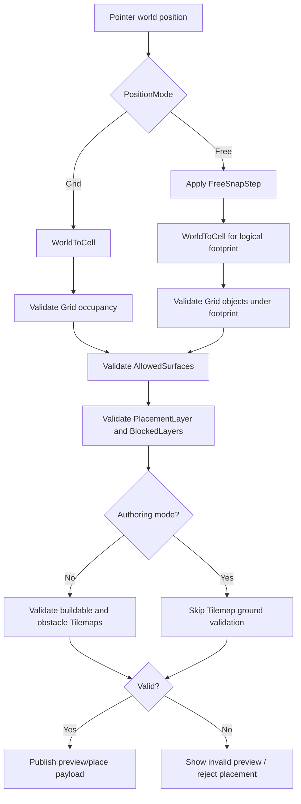

# Map Placement Rules

Tài liệu này mô tả hệ thống placement của module `Map`: cách object được căn vị trí, cách phân lớp va chạm, cách xác định bề mặt hợp lệ, thứ tự validation và các quy tắc cần tuân thủ khi thêm object mới.

Phạm vi chính:

- [`ObjectDatabaseSO.cs`](Scripts/SO/ObjectDatabaseSO.cs): định nghĩa dữ liệu và enum placement.
- [`MapService.cs`](Scripts/Service/MapService.cs): điều phối preview, placement, move, restore, spawn và persistence.
- [`MapPlacementValidator.cs`](Scripts/Service/MapPlacementValidator.cs): kiểm tra footprint, surface và layer collision.
- [`GridData.cs`](Scripts/SO/GridData.cs): lưu occupancy của object Grid.
- [`Objects.asset`](Configs/Objects.asset): cấu hình rule cho từng loại object.
- [`MapLayoutSO.cs`](Scripts/SO/MapLayoutSO.cs): dữ liệu layout gốc của map.

---

## 1. Mục tiêu thiết kế

Hệ thống tách riêng ba câu hỏi:

1. Object được đặt theo Grid hay theo tọa độ tự do?
2. Object xung đột với những nhóm object nào?
3. Object được đặt trên loại bề mặt nào?

Ba câu hỏi này lần lượt do các thuộc tính sau xử lý:

| Nhóm | Thuộc tính chính | Trách nhiệm |
| --- | --- | --- |
| Tọa độ | `PositionMode`, `FreeSnapStep`, `Size` | Tính vị trí và footprint logic |
| Va chạm | `PlacementLayer`, `BlockedLayers` | Quyết định hai object có được chồng lên nhau không |
| Bề mặt | `ProvidedSurface`, `AllowedSurfaces` | Quyết định object tạo và chấp nhận loại mặt nền nào |

`PositionMode` không phải collision policy. Một object Free vẫn có thể chặn object Grid; một object Grid như Lake vẫn có thể cho phép decor Free phủ lên.

### Phân chia trách nhiệm runtime

```text
MapService
 ├── điều phối placement state và authoring
 ├── điều phối player removal mode
 ├── gọi Tilemap validation
 ├── cập nhật occupancy
 ├── publish spawn/preview events
 └── restore layout/player save

MapPlacementValidator
 ├── không sở hữu placement state
 ├── kiểm tra Grid occupancy
 ├── kiểm tra logical footprint
 ├── kiểm tra PlacementLayer/BlockedLayers
 └── kiểm tra ProvidedSurface/AllowedSurfaces

GridData
 └── lưu occupancy của object Grid theo cell
```

`MapPlacementValidator` chỉ đọc `ObjectDatabaseSO`, `GridData` và registry Free hiện tại. Nó không spawn, destroy, ghi save hoặc cập nhật authoring UI.

---

## 2. Dữ liệu `ObjectData`

Mỗi entry trong `Objects.asset` sử dụng cấu trúc `ObjectData`:

```csharp
[Serializable]
public struct ObjectData
{
    public string name;
    public int ID;
    public Vector2Int Size;
    public MapObjectKind Kind;
    public PlacementInputMode PlacementInputMode;
    public PlacementPositionMode PositionMode;
    public float FreeSnapStep;
    public MapPlacementLayer PlacementLayer;
    public MapPlacementLayer BlockedLayers;
    public MapSurfaceType ProvidedSurface;
    public MapSurfaceType AllowedSurfaces;
    public MapObjectRotationMode RotationMode;
    public AssetReferenceGameObject Prefab;
}
```

### `ID`

- Phải duy nhất trong `ObjectDatabaseSO`.
- Layout và player save tham chiếu object bằng ID.
- Không được đổi ID của object đã xuất hiện trong layout hoặc save đã phát hành, trừ khi có migration.

### `Size`

- Là footprint logic theo `(x, z)`.
- Grid object dùng `Size` để chiếm nhiều ô trong `GridData`.
- Free object dùng ô chứa pivot làm origin rồi mở rộng footprint theo chiều dương `x` và `z`.
- Mỗi chiều được chuẩn hóa tối thiểu thành `1` khi validation layer/surface.
- `Size` không tự lấy từ sprite, renderer, collider hoặc scale của prefab.

### `Kind`

`MapObjectKind` phục vụ logic gameplay, ví dụ `Soil` và `Barn`. Nó không thay thế `PlacementLayer`.

Ví dụ `Main House` có thể vẫn mang `Kind = Decoration` theo dữ liệu cũ nhưng phải dùng `PlacementLayer = Gameplay` vì nó là công trình chiếm chỗ.

### `PlacementInputMode`

| Giá trị | Hành vi |
| --- | --- |
| `Single` | Preview trong lúc giữ/kéo, đặt một lần khi nhả tay |
| `Continuous` | Đặt liên tục khi nhấn và kéo qua các vị trí hợp lệ |

### `PositionMode`

| Giá trị | Hành vi |
| --- | --- |
| `Grid` | World position được chuyển thành cell và object được đặt tại `CellToWorld(cell)` |
| `Free` | Giữ world position; có thể làm tròn bằng `FreeSnapStep` |

### `FreeSnapStep`

- Chỉ áp dụng cho `PositionMode = Free`.
- `0`: không snap.
- Giá trị dương: làm tròn tọa độ `x` và `z` theo bước đó.
- Ví dụ `0.1` cho phép di chuyển theo bước 0.1 world unit.

---

## 3. Placement layer

`MapPlacementLayer` là flags enum:

```csharp
[Flags]
public enum MapPlacementLayer
{
    None         = 0,
    Surface      = 1 << 0, // 1
    Gameplay     = 1 << 1, // 2
    SolidDecor   = 1 << 2, // 4
    OverlayDecor = 1 << 3  // 8
}
```

Một object có đúng một `PlacementLayer`. `BlockedLayers` có thể chứa nhiều layer.

### `Surface`

Dùng cho object tạo thành lớp nền hoặc địa hình logic:

- Lake
- Đường
- Nền tuyết, cát hoặc bùn
- Các vùng bề mặt đặc biệt

Surface có thể cho decor nằm phía trên nhưng vẫn chặn Gameplay.

### `Gameplay`

Dùng cho object tham gia gameplay hoặc chiếm không gian xây dựng:

- Soil
- Barn
- Main House
- Storage
- Các công trình tương lai

Gameplay thường chặn `Surface`, `Gameplay` và `SolidDecor`.

### `SolidDecor`

Dùng cho trang trí có ý nghĩa chiếm chỗ:

- Cây
- Bụi lớn
- Đá
- Tượng hoặc đồ trang trí cỡ lớn

Solid Decor thường chặn `Gameplay`, để không thể xây chuồng hoặc ruộng đè lên decor.

### `OverlayDecor`

Dùng cho trang trí không chiếm chỗ:

- Hoa nhỏ
- Cỏ nhỏ
- Lá rơi
- Decal
- Hiệu ứng trang trí

Overlay Decor thường có `BlockedLayers = None` và được phép phủ lên các layer khác.

### `None`

`None` không tham gia layer collision. Không nên dùng cho object thật trừ khi object đó cố ý bỏ qua toàn bộ va chạm.

---

## 4. Quy tắc `BlockedLayers`

Hai object xung đột nếu một trong hai object chặn layer của object còn lại:

```csharp
bool conflict =
    (first.BlockedLayers & second.PlacementLayer) != 0 ||
    (second.BlockedLayers & first.PlacementLayer) != 0;
```

Kiểm tra hai chiều giúp kết quả không phụ thuộc thứ tự đặt.

Ví dụ:

- Lake chặn `Gameplay`.
- Cây SolidDecor chặn `Gameplay`.
- Rock dùng để ghép cụm visual là `OverlayDecor`; vùng cấm xây của cụm được author riêng bằng `DecorBlockedCells`.

### Ma trận rule đề xuất

Ký hiệu `X` nghĩa là không được overlap; `✓` nghĩa là được phép về mặt layer.

| Object đang có / Object mới | Surface | Gameplay | SolidDecor | OverlayDecor |
| --- | ---: | ---: | ---: | ---: |
| Surface | X | X | ✓ | ✓ |
| Gameplay | X | X | X | ✓ |
| SolidDecor | ✓ | X | ✓ | ✓ |
| OverlayDecor | ✓ | ✓ | ✓ | ✓ |

Ma trận trên được biểu diễn bằng cấu hình:

| Layer | `BlockedLayers` đề xuất | Giá trị flags |
| --- | --- | ---: |
| Surface | `Surface, Gameplay` | `3` |
| Gameplay | `Surface, Gameplay, SolidDecor` | `7` |
| SolidDecor | `Gameplay` | `2` |
| OverlayDecor | `None` | `0` |

### Giới hạn Free–Free hiện tại

`MapPlacementValidator` hiện kiểm tra:

- Grid với Grid.
- Grid với Free.
- Free với Grid.

Hệ thống chưa kiểm tra Free với Free. Vì vậy hai cây/đá Free vẫn có thể chồng lên nhau, kể cả khi cấu hình mask của chúng chặn nhau.

Đây là hành vi có chủ ý trong phiên bản hiện tại để author có thể xếp decor dày. Nếu cần chống chồng Free–Free, phải bổ sung spatial query cho `_freePlacements`; không nên đưa Free object vào `GridData` vì như vậy sẽ làm mất đặc tính đặt tự do.

---

## 5. Surface rule

`MapSurfaceType` cũng là flags enum:

```csharp
[Flags]
public enum MapSurfaceType
{
    None  = 0,
    Land  = 1 << 0, // 1
    Water = 1 << 1, // 2
    Any   = Land | Water // 3
}
```

### `ProvidedSurface`

Cho biết object tạo ra bề mặt gì trên footprint của nó.

| Giá trị | Ý nghĩa |
| --- | --- |
| `None` | Không thay đổi surface |
| `Land` | Cung cấp mặt đất |
| `Water` | Cung cấp mặt nước |

Hiện `GetSurfaceAt(cell)` chỉ đọc object nằm trong `GridData`. Vì vậy `ProvidedSurface` chỉ nên cấu hình cho object Grid.

Nếu không có Grid object cung cấp surface tại cell, hệ thống mặc định cell đó là `Land`.

### `AllowedSurfaces`

Cho biết object được đặt trên bề mặt nào:

| Giá trị | Ý nghĩa |
| --- | --- |
| `Land` | Chỉ trên đất |
| `Water` | Chỉ trên nước |
| `Any` | Trên đất hoặc nước |

Để tương thích dữ liệu cũ, `AllowedSurfaces = None` hiện được xử lý như `Any`. Dù vậy, object mới phải cấu hình giá trị rõ ràng.

### Ví dụ

```text
Lake
  ProvidedSurface = Water
  AllowedSurfaces = Land

Barn
  ProvidedSurface = None
  AllowedSurfaces = Land

Lily Pad
  ProvidedSurface = None
  AllowedSurfaces = Water

Rock
  ProvidedSurface = None
  AllowedSurfaces = Any
```

Lake được đặt trên vùng mặc định Land rồi biến footprint của nó thành Water. Lily Pad chỉ hợp lệ trên footprint của Lake. Barn chỉ hợp lệ trên Land.

Surface rule và layer rule đều phải hợp lệ. Việc một object được phép trên Water không có nghĩa nó tự động được phép overlap Lake; layer của hai object cũng phải không xung đột.

---

## 6. Grid occupancy

`GridData` dùng dictionary ánh xạ mỗi cell sang một `PlacementData`.

Một Grid object kích thước `3x3` chiếm chín cell:

```text
origin = (10, 0, 5)

(10,5) (11,5) (12,5)
(10,6) (11,6) (12,6)
(10,7) (11,7) (12,7)
```

### Grid–Grid luôn độc quyền

Trong implementation hiện tại, hai Grid object không bao giờ được dùng chung cell, kể cả layer mask về lý thuyết cho phép overlap. Lý do là `GridData` chỉ giữ một `PlacementData` trên mỗi cell.

Hệ quả:

- Lake Grid không thể chồng Lake Grid.
- Soil Grid không thể chồng Road Grid.
- Barn Grid không thể chồng Lake Grid.
- Decor Free vẫn có thể đặt phía trên Lake Grid nếu layer và surface cho phép.

Nếu tương lai cần nhiều Grid layer cùng một cell, ví dụ `Terrain + Road + Bridge`, phải đổi `GridData` thành cấu trúc nhiều occupancy layer hoặc các grid registry tách biệt.

---

## 7. Footprint của Free object

Free object vẫn cần footprint logic để kiểm tra giao với Grid.

Quy trình:

1. Lấy world position của pivot.
2. Chuyển sang cell bằng `WorldToCell`.
3. Cell đó là origin footprint.
4. Mở rộng footprint theo `Size` về chiều dương `x` và `z`.

Ví dụ:

```text
Free object position = (3.8, 0, 5.2)
WorldToCell          = (3, 0, 5)
Size                 = (1, 1)
Blocked cell         = (3, 0, 5)
```

Nếu sprite tràn sang cell bên cạnh, cell đó không tự động bị tính vào footprint.

### Scale

Scale trong authoring chỉ thay đổi phần hiển thị:

- Không thay đổi `Size`.
- Không thay đổi collision footprint.
- Không thay đổi erase/select radius.

Nếu một decor lớn cần chặn nhiều ô, phải cấu hình `Size` riêng hoặc mở rộng hệ thống bằng footprint/bounds chuyên dụng.

---

## 8. Thứ tự validation khi preview và đặt object

### Grid object

`MapPlacementValidator.CanPlaceGrid` thực hiện:

1. Chuẩn hóa `Size`, mỗi chiều tối thiểu là 1.
2. Kiểm tra footprint chưa có Grid object khác.
3. Kiểm tra tất cả cell thuộc `AllowedSurfaces`.
4. Duyệt Free placement và kiểm tra layer conflict nếu footprint giao nhau.
5. Khi placement trực tiếp trong gameplay, kiểm tra thêm buildable/obstacle tilemap.

### Free object

`MapPlacementValidator.CanPlaceFree` thực hiện:

1. Chuyển world position sang origin cell.
2. Chuẩn hóa `Size`.
3. Kiểm tra tất cả cell thuộc `AllowedSurfaces`.
4. Với mỗi cell có Grid object, kiểm tra layer conflict.
5. Không kiểm tra các Free object khác.
6. Khi placement trực tiếp trong gameplay, kiểm tra thêm buildable/obstacle tilemap tại cell pivot.

### Flow tổng quát



---

## 9. Authoring mode

Authoring mode dùng cùng layer, surface và footprint rule với gameplay.

Điểm khác biệt duy nhất liên quan validation là authoring bỏ qua `IsTilemapPlacementValid`, tức không yêu cầu buildable tile và không kiểm tra obstacle tilemap.

Authoring vẫn kiểm tra:

- Grid occupancy.
- Surface rule.
- Grid–Free layer conflict.
- Decor blocker cells.
- Rule khi kéo object đã chọn.

Điều này bảo đảm layout lưu ra không vi phạm placement contract chính.

### Di chuyển object

- Free object: tính vị trí mới, kiểm tra surface và Grid conflict trước khi cập nhật transform/layout.
- Grid object: tạm gỡ footprint cũ, kiểm tra vị trí mới; nếu thất bại thì phục hồi footprint cũ.
- Scale: chỉ cập nhật transform và `UniformScale`, không tính lại footprint.

### Force overlap

Hiện chưa có chế độ force overlap. Nếu bổ sung, nó phải là thao tác authoring rõ ràng và không được âm thầm vô hiệu hóa validation mặc định.

---

## 10. Runtime placement và Tilemap

Ngoài rule trong tài liệu này, runtime placement còn gọi `IsTilemapPlacementValid`:

- Buildable tilemaps: mỗi cell phải có ít nhất một tile nền hợp lệ nếu danh sách được cấu hình.
- Obstacle tilemaps: không cell nào được chứa obstacle tile.

### Decor blocker cell mask

`MapLayoutSO.DecorBlockedCells` là logical tilemap dành riêng cho decor được ghép tự do. Trong Author:

- `Paint decor blocker`: kéo chuột để tô cell đỏ.
- `Erase decor blocker`: kéo chuột để xóa cell.
- `Hide/Show blocker overlay`: chỉ đổi hiển thị, không đổi dữ liệu.
- `Save layout`: lưu mask cùng object layout.

Gameplay object chỉ hợp lệ khi toàn bộ footprint không chạm mask. Rock visual không tự sinh collision từ
sprite, pivot hoặc scale; author quyết định chính xác cell nào thuộc cụm decor.
- Grid object kiểm tra toàn bộ `Size`.
- Free object hiện chỉ kiểm tra tilemap tại cell chứa pivot bằng footprint `1x1`.

Surface không thay thế Tilemap validation:

- `MapSurfaceType` mô tả semantic như Land/Water.
- Buildable/obstacle Tilemap mô tả vùng map vật lý có thể tương tác.

---

## 11. Layout gốc và player save

### Dữ liệu layout

`MapLayoutSO` lưu:

- `InstanceId`
- `ObjectId`
- `PositionMode`
- `OriginCell`
- `WorldPosition`
- `UniformScale`

Layer và surface policy không được copy vào layout. Chúng luôn được đọc từ `Objects.asset` theo `ObjectId`, giúp thay đổi rule tập trung tại database.

### Thứ tự restore

Runtime thực hiện:

1. Restore base `MapLayoutSO`.
2. Nếu không ở authoring mode, restore player placements.

Base layout vì vậy có quyền ưu tiên. Player Grid placement xung đột với base layout hoặc blocking decor sẽ bị bỏ qua.

Các placement được restore vẫn kiểm tra occupancy, surface và layer. Restore hiện không gọi Tilemap ground validation.

### Player removal hiện tại

Gameplay có removal mode liên tục, chỉ thoát khi người chơi nhấn Cancel:

```text
Nhấn Remove
    ↓
Tap object (drag/pinch chỉ điều khiển camera, không xóa)
    ↓
InstanceId có trong player MapPlacements?
    ├── Không → từ chối; base layout được bảo vệ
    └── Có
         ↓
    IMapPlacementRemovalPolicy cho phép?
         ├── Không → giữ removal mode để chọn lại hoặc Cancel
         └── Có → release occupancy, destroy instance, xóa save và giữ removal mode
```

Ownership ở giai đoạn này được xác định bằng nguồn persistence:

- Có `InstanceId` trong `IMapSaveSource.MapPlacements`: player-owned, có thể được xem xét xóa.
- Chỉ có trong `MapLayoutSO`: base-map object, không thể xóa trong gameplay.

Map không tham chiếu trực tiếp tới Farm. Module gameplay có thể triển khai `IMapPlacementRemovalPolicy` để veto removal và dọn state thuộc module đó.

FarmService hiện áp dụng rule:

- Soil/Barn chưa có cây hoặc vật nuôi: được xóa.
- Soil đang có cây: không được xóa.
- Barn đang có vật nuôi: không được xóa.
- Khi xóa Soil/Barn rỗng, farm slot rỗng tương ứng cũng được loại khỏi player save trước khi `SaveMap` ghi dữ liệu.

Player save cũ thiếu `instanceId` được cấp ID một lần khi restore và được save lại, để các thao tác remove sau đó nhận diện đúng ownership.

### Thay đổi rule sau khi đã có save

Nếu thay `PlacementLayer`, `BlockedLayers` hoặc `AllowedSurfaces`, một placement cũ có thể trở thành không hợp lệ ở lần load tiếp theo.

Khi phát hành game, cần chọn một migration policy rõ ràng:

- Bỏ placement không hợp lệ và hoàn vật phẩm/tiền.
- Di chuyển object tới vị trí hợp lệ gần nhất.
- Giữ placement cũ nhưng áp dụng rule mới chỉ cho lần đặt tiếp theo.

Hệ thống hiện chọn cách bỏ qua placement không thể restore và ghi warning; chưa có cơ chế refund hoặc relocation.

---

## 12. Cấu hình hiện tại

### Decor Free có collision

Banana Tree, Bonsai và Bush:

```text
PositionMode     = Free
PlacementLayer   = SolidDecor
BlockedLayers    = Gameplay
ProvidedSurface  = None
AllowedSurfaces  = Any
Size             = 1x1
```

Kết quả:

- Được đặt trên Land hoặc Lake/Water.
- Không được đặt trên nhà, chuồng, ruộng hoặc kho.
- Chặn công trình/ruộng mới đặt lên footprint của nó.
- Có thể chồng lên decor Free khác.

### Rock ghép cụm visual

Rock 1 và Rock 2:

```text
PositionMode     = Free
PlacementLayer   = OverlayDecor
BlockedLayers    = None
ProvidedSurface  = None
AllowedSurfaces  = Any
Size             = 1x1
```

Rock không tự chặn cell. Sau khi ghép cụm, dùng `Paint decor blocker` để đánh dấu đúng vùng cấm xây.

### Soil, Barn, Main House, Storage

```text
PositionMode     = Grid
PlacementLayer   = Gameplay
BlockedLayers    = Surface | Gameplay | SolidDecor
ProvidedSurface  = None
AllowedSurfaces  = Land
```

Kết quả:

- Chỉ đặt trên Land.
- Không được đặt trên Lake.
- Không được đặt đè Grid object khác.
- Không được đặt đè cây/bụi SolidDecor hoặc cell thuộc decor blocker mask.
- Overlay Decor vẫn có thể phủ lên nếu được bổ sung.

### Lake

```text
PositionMode     = Grid
Size             = 9x7
PlacementLayer   = Surface
BlockedLayers    = Surface | Gameplay
ProvidedSurface  = Water
AllowedSurfaces  = Land
```

Kết quả:

- Lake được dựng trên vùng Land.
- Footprint của Lake trở thành Water về semantic.
- Lake chặn công trình và ruộng.
- Bụi, cây và đá hiện được phép phủ lên Lake vì chúng chấp nhận `Any` và không xung đột layer Surface.

---

## 13. Công thức chọn cấu hình cho object mới

### Công trình gameplay

```text
PositionMode     = Grid
PlacementLayer   = Gameplay
BlockedLayers    = Surface | Gameplay | SolidDecor
ProvidedSurface  = None
AllowedSurfaces  = Land
```

### Cây hoặc đá có chiếm chỗ

```text
PositionMode     = Free
PlacementLayer   = SolidDecor
BlockedLayers    = Gameplay
ProvidedSurface  = None
AllowedSurfaces  = Land hoặc Any
```

### Hoa súng

```text
PositionMode     = Free
PlacementLayer   = OverlayDecor
BlockedLayers    = None
ProvidedSurface  = None
AllowedSurfaces  = Water
```

### Hoa/cỏ không chặn placement

```text
PositionMode     = Free
PlacementLayer   = OverlayDecor
BlockedLayers    = None
ProvidedSurface  = None
AllowedSurfaces  = Land
```

### Đường hoặc mặt nền đặc biệt

```text
PositionMode     = Grid
PlacementLayer   = Surface
BlockedLayers    = Surface hoặc Surface | Gameplay
ProvidedSurface  = Land
AllowedSurfaces  = Land
```

Lưu ý: do Grid–Grid đang độc quyền, đường Grid chưa thể phủ lên một Surface Grid khác dù mask cho phép.

---

## 14. Checklist khi thêm object

1. Chọn `ID` duy nhất và không tái sử dụng ID cũ.
2. Chọn `Kind` theo nhu cầu gameplay.
3. Chọn `PositionMode` theo trải nghiệm đặt, không theo collision.
4. Cấu hình `Size` theo footprint logic, không theo kích thước ảnh.
5. Chọn đúng một `PlacementLayer`.
6. Cấu hình `BlockedLayers` theo ma trận mong muốn.
7. Chỉ đặt `ProvidedSurface` cho Grid Surface object.
8. Luôn cấu hình `AllowedSurfaces` rõ ràng.
9. Chọn `Single` hay `Continuous` cho input.
10. Kiểm tra pivot prefab vì pivot quyết định cell của Free object.
11. Test preview hợp lệ và không hợp lệ.
12. Với decor ghép cụm, paint blocker và kiểm tra toàn bộ rìa visual.
13. Test authoring move, scale, save và reload.
14. Test base layout cùng player save cũ.

---

## 15. Test matrix tối thiểu

| Trường hợp | Kết quả mong đợi |
| --- | --- |
| Rock Free trên Land trống | Được |
| Rock Free trên Lake | Được với cấu hình hiện tại |
| Barn Grid trên Lake | Không được |
| Barn Grid trên cell blocker dưới Rock | Không được |
| Barn Grid cạnh Rock nhưng ngoài blocker | Được |
| Rock Overlay trên Barn | Được về layer; Author chịu trách nhiệm bố cục |
| Rock Free chồng Rock Free | Được trong implementation hiện tại |
| Soil Grid chồng Soil Grid | Không được |
| Flower Overlay trên Barn | Được nếu Flower dùng mask đề xuất |
| Lily Pad Water trên Land | Không được |
| Lily Pad Water trên Lake | Được |
| Move Lake vào Grid footprint khác | Không được và Lake trở lại vị trí cũ |
| Paint/erase blocker | Preview Grid cập nhật theo mask |
| Scale Rock | Visual đổi, blocker giữ nguyên cho tới khi Author paint lại |
| Load player Barn trùng base Lake | Player Barn bị bỏ qua |

---

## 16. Hướng mở rộng

Các nhu cầu sau chưa được hỗ trợ đầy đủ:

### Nhiều Grid layer trên cùng cell

Cần thay dictionary một occupancy bằng registry theo layer, ví dụ:

```text
cell
  Surface: Lake
  Path: Bridge
  Gameplay: null
```

### Free–Free collision chính xác

Cần spatial hash, quadtree hoặc danh sách bounds theo vùng. Không nên duyệt toàn bộ Free object mỗi frame khi map lớn.

### Footprint theo bounds hoặc shape

Cần asset footprint riêng thay vì tự suy ra từ sprite/collider runtime. Có thể hỗ trợ:

- Rectangle có offset.
- Circle radius.
- Danh sách cell tùy chỉnh.
- Polygon cho object đặc biệt.

### Scale ảnh hưởng footprint

Nếu cần, phải quy định rõ cách làm tròn cell và cập nhật occupancy khi slider scale thay đổi. Không nên tự động dùng renderer bounds vì sprite pivot và camera rotation có thể làm footprint không ổn định.

### Migration save

Cần version cho map placement save cùng chiến lược refund/relocation khi base layout hoặc collision rule thay đổi.

---

## 17. Nguyên tắc bắt buộc

- Không dùng `PositionMode` để suy ra collision.
- Không dùng `MapObjectKind` để suy ra placement layer.
- Không dùng kích thước sprite làm footprint ngầm.
- Không vô hiệu hóa collision mặc định trong authoring.
- Mọi ngoại lệ phải được biểu diễn bằng data rule hoặc một authoring override rõ ràng.
- Thay đổi rule đã phát hành phải xem xét ảnh hưởng tới player save.
